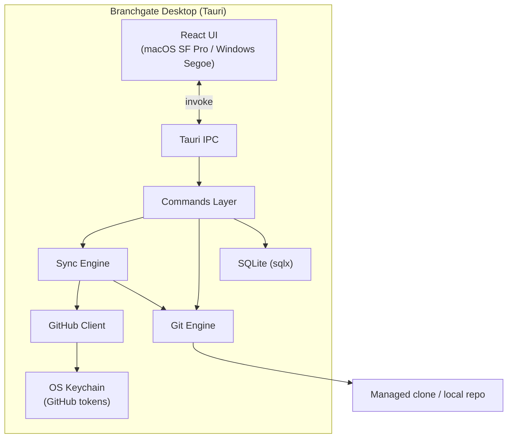

# Branchgate Architecture

Branchgate is a **local-first Tauri desktop app**: a Rust backend handles git, sync, and persistence; a React frontend provides the UI. All user data stays on-device unless they connect a remote repo (and even then, only GitHub metadata is fetched).

## High-level diagram



## Repository layout

```
branchgate/
├── src/                      # React + TypeScript frontend
│   ├── components/layout/    # App shell, sidebar
│   ├── pages/                # Dashboard, Pipeline, History, Settings, Onboarding
│   ├── hooks/                # Theme, etc.
│   ├── lib/                  # Tauri IPC wrappers
│   └── styles/               # Design tokens, platform fonts
├── src-tauri/                # Rust backend
│   ├── src/
│   │   ├── commands/         # IPC handlers (app, pipelines, repos, sync…)
│   │   ├── db/               # SQLite pool + migrations
│   │   ├── git/              # Cherry-pick engine (planned)
│   │   ├── github/           # GraphQL/REST client (planned)
│   │   └── sync/             # Incremental PR sync (planned)
│   └── migrations/           # Schema DDL
└── docs/v1/                  # Product spec + design handoff
```

## Layer responsibilities

| Layer | Role |
|-------|------|
| **React UI** | Pipelines dashboard, PR checklist, promotion progress, conflict handoff, settings |
| **Tauri IPC** | Thin boundary — typed commands, no business logic in the frontend |
| **Commands** | Orchestrate use-cases: list pipelines, sync, promote, resolve conflicts |
| **Sync engine** | Incremental fetch of merged PRs; patch-id computation for "already promoted?" |
| **Git engine** | Fetch, branch, cherry-pick in merge order, conflict detection |
| **GitHub client** | OAuth device flow, GraphQL batch sync, PR creation |
| **SQLite** | Pipelines, PRs, promotions, runs, conflicts, settings |
| **OS Keychain** | GitHub tokens — never stored in SQLite or on disk in plaintext |

## Data model (summary)

| Table | Purpose |
|-------|---------|
| `repos` | Connected repo (remote GitHub or local path) |
| `pipelines` | `(repo, source_branch, target_branch)` promotion path |
| `branch_sync_state` | Incremental sync checkpoints |
| `pull_requests` | Merged PR metadata |
| `pr_commits` | Commits per PR with content-based `patch_id` |
| `promotions` | Per-pipeline PR status (pending → promoted) |
| `promotion_runs` | One "promote selected" action |
| `conflicts` | Cherry-pick conflicts within a run |
| `editors` | Detected code editors for conflict resolution |

Full DDL: `src-tauri/migrations/001_initial.sql`

## Platform targets

| Platform | Bundle targets | Typography |
|----------|----------------|------------|
| **macOS** | `.app`, `.dmg` | SF Pro via `-apple-system` / SF Mono |
| **Windows** | `.exe`, NSIS `.msi` | Segoe UI Variable, Cascadia Code |

Linux is intentionally excluded from v1 bundle targets.

## Core flows (planned)

### 1. Connect repo
- **Remote:** GitHub OAuth device flow → pick org/repo → managed or existing clone
- **Local:** file picker → infer PRs from merge commits

### 2. Sync pipeline (manual refresh)
Walk commits since `branch_sync_state.source_head_sha`, fetch PR metadata, compute `patch_id` per commit, mark promotions as pending if patch not on target.

### 3. Promote selected PRs
1. Branch off `target_branch`
2. Cherry-pick selected PRs in merge order
3. On conflict → stop, open editor, resume or abort
4. Push + open GitHub PR (remote) or leave local branch (local mode)

## Tech stack

| Concern | Choice |
|---------|--------|
| Shell | Tauri 2 |
| Backend | Rust |
| Frontend | React 19 + TypeScript + Vite |
| Database | SQLite via sqlx |
| Secrets | `keyring` crate (planned) |
| Git | `git2-rs` or system `git` CLI (TBD) |

## Build status (scaffold)

- [x] Tauri + React project scaffold
- [x] SQLite schema + migrations
- [x] App shell UI (dashboard, sidebar, settings, onboarding)
- [x] Platform-native fonts (macOS / Windows)
- [ ] GitHub OAuth device flow
- [ ] Repo connection + pipeline CRUD
- [ ] Sync engine + patch-id matching
- [ ] Cherry-pick promotion engine
- [ ] Conflict resolution + editor handoff

## v2 (out of scope)

Hosted web app, Postgres, GitHub App + webhooks, multi-user teams, shared audit log.
